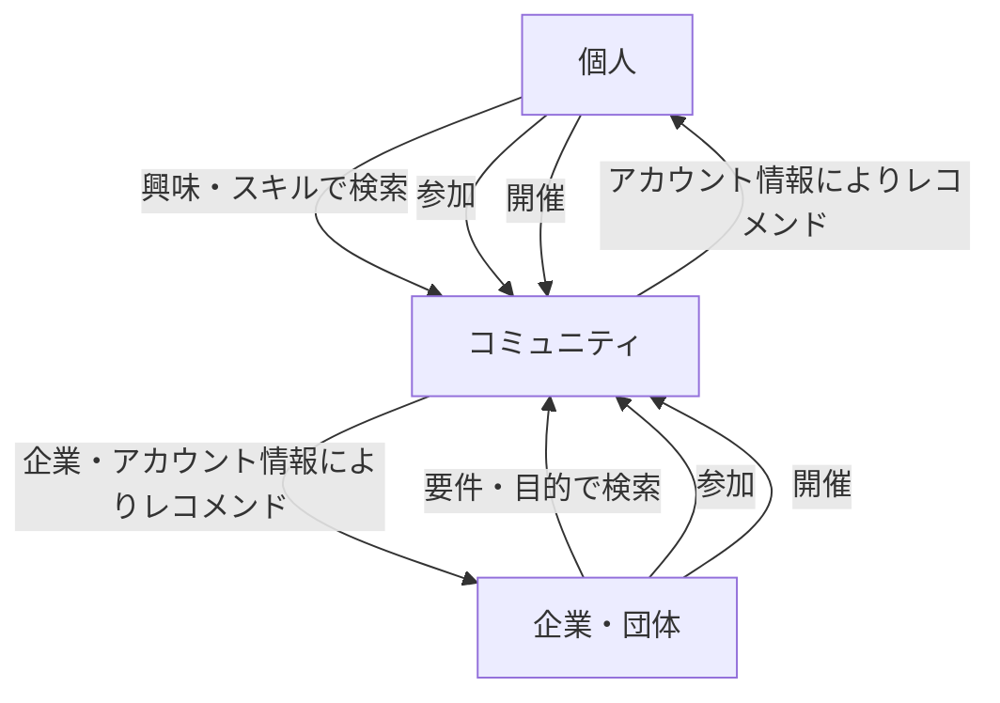

---

# commutt -コミュニティマッチングシステム開発- 企画書 ver.0.1 

**株式会社 ASW** （2025年10月24日作成） 

---

## - 目次 -

### 1. 概要
- 1-1. [企画意図](#1-1-企画意図) 
- 1-2. [システムの目的](#1-2-システムの目的)

### 2. 開発の背景
- 2-1.[社会構造の変化](#2-1-社会構造の変化)
- 2-2.[現状の課題](#2-2-現状の課題)
  - (1) コミュニティの分散化
  - (2) コミュニティへの非定着化
- 2-3.[解決すべきポイント](#2-3-解決すべきポイント)

### 3. システム開発の方向性
- 3-1.[課題解決のための方向性](#3-1-課題解決のための方向性)
- 3-2.[コンセプト図](#3-2-コンセプト図)

### 4. 目指すべきシステムと社会との関係性

## 1. 概要
### 1-1. 企画意図
私たちは何らかのコミュニティに所属して生活している。家族、友人、学校、会社、または趣味の集まりなど様々だ。
それらのコミュニティは過去から現在に至るまで形態や様相を流動的に変化させている。家族で言えば２世帯が生活していた大家族から核家族や子供のいない夫婦、または単身者。会社・企業で言えば正社員登用で終身雇用が当たり前だった時代から転職や非正規、有期雇用などに変化している。
ライフサイクルが変化する中で希薄と言われている近所付き合い、数や種類を増やしているであろう趣味を通してのオフ会やビジネスやプライベートを問わない勉強会。それらをオンライン上で行うネットの普及。SNSの発展。コミュニティの数や種類だけ切り取って言えば現代の方がネットが発達する以前より明らかに増えていると思われる。
だが新規のコミュニティ全てではないにせよいずれのコミュニティも参加する者に安定して役割を提供できていないと危惧している。あるいは濃淡でいうところの濃い部分である。
では、そういったかつての形態のコミュニティを再現したり密度を上げていけばいいのか？ある種現代にそぐわない、または希望しないので様相を変化させてきているのではないか？
煩雑な言い方をすれば全従業員強制参加の社員旅行が定期的に行われ普段の業前業後も時間を共にしなければならない企業があり、非正規や有期雇用を含めいつ解雇されるかもわからない者が人生の多くの時間を捧げなければならないというのは酷な話ではないだろうか。その者は自然とそういった共同体にのみ属する形となり仕事の不満をこぼすことの出来るコミュニティもそこしかないのである。当然愚痴をこぼすこともできなくなるのである。
こういった前時代的で閉鎖的なコミュニティを再構築するような愚策に走ることなく参加する者に役割を供給するにはどうしたらいいのだろうか。
本企画は、上記で危惧されている現代のコミュニティが抱える問題を解決するために新システムを開発することを意図とする。

### 1-2. システムの目的

当システムは**個人とコミュニティとの出会いの場を設けるマッチングシステム**である。

個人と企業または団体がホストとなるコミュニティ、またはその逆、あるいは個人と個人がホストとなるコミュニティ、企業または団体と企業または団体がホストとなるコミュニティ。

- 個人 × 企業・団体  
- 個人 × 個人  
- 企業・団体 × 企業・団体  

いずれの場合も網羅した**多層的なマッチング機構**により、人が何らかの機能や役割を安定的に担うことのできる数の大小問わない幾つかのコミュニティをもちそのことによって自己の肯定につなげていく。「生きる場を取り戻すための仕組みづくり」その役割の一端を担うことのできるシステムである。

## 2. 開発の背景

### 2-1. 社会構造の変化
私たちが所属して生活しているコミュニティは現代社会では以下のような変化が進んでいる。

- 家族構成の変化（核家族化・単身化）
- 雇用形態の多様化（非正規・副業・転職）
- オンラインによるつながりの増加（SNS・リモート・オンラインサロン）

テクノロジーの進化やライフサイクルが変化する中でコミュニティの数や種類だけ切り取って言えば現代の方がインターネットなどが発達する以前より明らかに増えていると思われる。

### 2-2. 現状の課題

#### (1) コミュニティの分散化
個人間でのマッチングアプリ・webサービスは多数存在している。
しかし、個人と企業や団体その他コミュニティとのマッチングのサービスは業種や業界または目的ごとに点在して、その業種の関係者であってもそういったコミュニティサービスがあること自体を把握しきれていないのが現状だと思われる。

#### (2) コミュニティへの非定着化
既存または新規のコミュニティ、いずれのコミュニティも形態や様相を変化させていく中で参加する者に安定して機能や役割を提供できていない。

### 2-3. 解決すべきポイント
- コミュニティの情報が業界・目的別に散在している  
- 参加者が自分に合ったコミュニティを発見しづらい  
- コミュニティが持続的に参加者への機能や役割を提供できていない

## 3. システム開発の方向性

### 3-1.課題解決のための方向性

1. **統合的なコミュニティ情報プラットフォーム**  
   - 業種・属性・目的を横断した一元的な検索・マッチングを実現する。

2. **多次元的なマッチングロジック**  
   - 属性（スキル・興味・地域）や目的（学び・活動・協働）に基づくマッチングを提供。

3. **役割の安定供給機構**  
   - 参加者が単なる「登録者」ではなく、何らかの「機能・役割」を果たせる仕組みを提供する。

### 3-2. コンセプト図

## 4. 目指すべきシステムと社会との関係性
当システムは、個人が自らの存在価値を再確認できる新しいコミュニティ形成の仕組みを提供する。
旧来型の組織や固定的な人間関係に代わり、柔軟かつ多様な形で「つながる」社会を目指す。
そして個人が役割を通じて承認される場をオンライン上で再構築しオフライン、つまり私たちが居る現実にフィードバックさせる試みである。
技術と思想の両面から、現代的な共同体の再定義に挑戦するものである。
