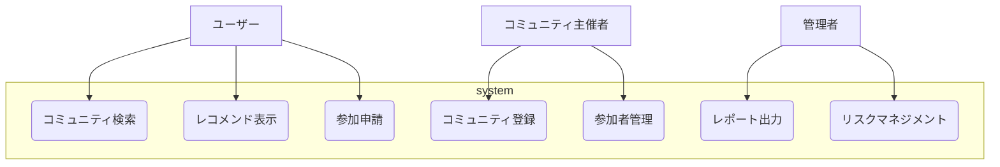

---

# 要件定義書 ver.0.1 

**株式会社 ASW** （2025年10月6日作成） 

---

## - 目次 -

### 1. 概要
- 1-1. [システムの目的](#1-1-システムの目的) 
- 1-2. [システム開発の背景](#1-2-システム開発の背景)
- 1-3. [ステークホルダー](#1-3-ステークホルダー)
- 1-4. [システムの全体像](#1-4-システムの全体像)

### 2. 開発環境および技術構成

### 3. システム要件
- 3-1.[機能要件](#3-1-機能要件)
- 3-2.[非機能要件](#3-2-非機能要件)

### 4. システム構成・外部連携
- 4-1.[システム構成](#4-1-システム構成)
- 4-2.[外部連携](#4-2-外部連携)
  

### 5. インターフェース
- 5-1.[ハードウェアインターフェース](#5-1-ハードウェアインターフェース) 
- 5-2.[ソフトウェアインターフェース](#5-2-ソフトウェアインターフェース)
- 5-3.[通信インターフェース](#5-3-通信インターフェース)

---

## 1. 概要
### 1-1. システムの目的
当システムは個人とコミュニティとの出会いの場を設けるマッチングシステムである。

私たちは何らかのコミュニティに所属して生活している。家族、友人、学校、会社、または趣味の集まりなど様々だ。
それらのコミュニティは過去から現在に至るまで形態や様相を流動的に変化させている。家族で言えば２世帯が生活していた大家族から核家族や子供のいない夫婦、または単身者。会社・企業で言えば正社員登用で終身雇用が当たり前だった時代から転職や非正規、有期雇用などに変化している。
ライフサイクルが変化する中で希薄と言われている近所付き合い、数や種類を増やしているであろう趣味を通してのオフ会やビジネスやプライベートを問わない勉強会。それらをオンライン上で行うネットの普及。SNSの発展。コミュニティの数や種類だけ切り取って言えば現代の方がネットが発達する以前より明らかに増えていると思われる。
だが新規のコミュニティ全てではないにせよいずれのコミュニティも参加する者に安定して役割を提供できていないと危惧している。あるいは濃淡でいうところの濃い部分である。
では、そういったかつての形態のコミュニティを再現したり密度を上げていけばいいのか？ある種現代にそぐわない、または希望しないので様相を変化させてきているのではないか？
煩雑な言い方をすれば全従業員強制参加の社員旅行が定期的に行われ普段の業前業後も時間を共にしなければならない企業があり、非正規や有期雇用を含めいつ解雇されるかもわからない者が人生の多くの時間を捧げなければならないというのは酷な話ではないだろうか。その者は自然とそういった共同体にのみ属する形となり仕事の不満をこぼすことの出来るコミュニティもそこしかないのである。当然愚痴をこぼすこともできなくなるのである。
こういった前時代的で閉鎖的なコミュニティを再構築するような愚策に走ることなく参加する者に役割を供給するにはどうしたらいいのだろうか。

当システムは個人と企業または団体がホストとなるコミュニティ、またはその逆、あるいは個人と個人がホストとなるコミュニティ、企業または団体と企業または団体がホストとなるコミュニティ。いずれの場合も網羅したコミュニティとのマッチングを行い、人が何かの機能や役割を安定的に担うことのできる幾つかの(数は多くなくてもいい)コミュニティをもつもことができそのことによって自己の肯定につなげていく。その役割の一端を担うことのできるシステムである。

### 1-2. システム開発の背景

<< 現状の課題 >>

個人間でのマッチングアプリ・webサービスは多数存在している。
しかし、個人と企業や団体その他コミュニティとのマッチングのサービスは業種や業界または目的ごとに点在して、その業種の関係者であってもそういったコミュニティサービスがあること自体を把握しきれていないのが現状だと思われる。
そういった散らばっているコミュニティを一括に統合して個人が各々の属性や目的によってアクセセスでき、マッチングを行うシステム開発を行う

### 1-3. ステークホルダー

<table border="1">
    <tr>
        <th>区分</th>
        <th>名称</th>
        <th>役割・責任</th>
    </tr>
    <tr>
        <td>ユーザー</td>
        <td>個人・企業または団体</td>
        <td>コミュニティの検索・参加申請を行う</td>
    </tr>
    <tr>
        <td>コミュニティ主催者</td>
        <td>主催者個人または企業・団体</td>
        <td>コミュニティ登録および参加者管理</td>
    </tr>
    <tr>
        <td>管理者</td>
        <td>運営企業</td>
        <td>システムの管理・不正利用監視・ホスト側の審査</td>
    </tr>
    <tr>
        <td>開発チーム</td>
        <td>システム開発担当</td>
        <td>システムの設計・開発・テスト・保守・運用</td>
    </tr>
</table>

### 1-4. システムの全体像

<table border="1">
    <tr>
        <th>システム名</th>
        <th>役割</th>
    </tr>
    <tr>
        <td>コミュニティとのマッチングシステム</td>
        <td>
            本システムはユーザー(個人または企業や団体)がコミュニティ検索もしくはユーザー情報に基づいたレコメンド機能を有する.
            また、コミュニティの主催側（個人または企業や団体）が当システムに開催情報を登録することや参加者を管理することが可能。
        </td>
    </tr>
</table>

以下に、システムの全体像を示す。

## 2. 開発環境および技術構成

<table border="1">
    <tr>
        <th>開発言語</th>
        <th>python, JavaScript</th>
    </tr>
    <tr>
        <th>フレームワーク</th>
        <th>Django,Django Rest Framework,  React, React Native</th>
    </tr>
    <tr>
        <th>データベース・ミドルウェア</th>
        <th>MySQL, Gunicorn, JWT</th>
    </tr>
    <tr>
        <th>対応アプリケーション</th>
        <th>Web, ネイティブ</th>
    </tr>
    <tr>
        <th>開発・実行環境</th>
        <th>Docker, git, VScode</th>
    </tr>
    <tr>
        <th>クラウド/サーバー環境</th>
        <th>Google Cloud Platform(Compute Engine, Cloud SQL, Cloud Storage)</th>
    </tr>
</table>

## 3. システム要件
### 3-1. 機能要件
#### 3-1-1. ロール別機能一覧

<table border="1">
    <tr>
        <th>ロール</th>
        <th>ロール種別</th>
        <th>機能要件</th>
    </tr>
    <tr>
        <td rowspan="2">ユーザー</td>
        <td>個人</td>
        <td  rowspan="2">コミュニティの検索・参加申請</td>
    </tr>
    <tr>
        <td>企業・団体</td>
    </tr>
        <td rowspan="2">ホスト</td>
        <td>個人</td>
        <td rowspan="2">コミュニティ登録、参加者管理</td>
    </tr>
    <tr>
        <td>企業・団体</td>
    </tr>
    <tr>
        <td>管理者</td>
        <td>運営企業</td>
        <td>システムの管理、ホスト審査</td>
    </tr>
</table>

#### 3-1-2. 利用規約同意機能
- システム利用開始時に、ユーザーは利用規約への同意が必須となる。  
- 同意しない場合、登録およびサービス利用はできない。  
- 利用規約は、システム上で明示的に表示される。  
- 利用規約の主な内容： 
  - コミュニティ内での連絡先共有は、各ユーザーまたは組織の責任において行う。  
  - 本サービスは、当該連絡・取引・トラブル等に関して一切の保証・責任を負わない。  
- 利用規約の全文は別途「利用規約書（Terms of Service）」として定義する。  
- 同意履歴はユーザーアカウントに紐付けてデータベースに保存する。

### 3-2. 非機能要件

#### （1）外部連携
- 決済システム（外部API）  
  - 外部決済サービスを利用し、電子決済を行う。  
- 地図表示  
  - Google Maps APIを使用して会場所在地を表示する。

#### （2）システム外要件
- 会場のブッキング  
  - コミュニティ開催に必要な会場予約は、外部の予約システムまたは担当者が別途手配する。  
  - 本システムでは会場情報の登録・管理のみを行い、実際の予約やケータリング手配はシステム外で実施する。  

- ケータリング等の手配  
  - コミュニティ開催時のケータリングや付帯サービスは、外部事業者との契約により実施する。

## 4. 開発環境および技術構成

### 4-1. システム構成

本概要書では詳細なシステム構成は省略する。
システム構成に関しては詳細設計参照

### 4-2. 外部連携

<table border="1">
    <tr>
        <th>外部システム名</th>
        <th>利用目的</th>
        <th>連携方式</th>
        <th>データ形式</th>
        <th>認証方式</th>
        <th>通信方式</th>
        <th>主な入出力項目</th>
        <th>備考</th>
    </tr>
    <tr>
        <td>Stripe API</td>
        <td>電子決済処理</td>
        <td rowspan="2">REST API（POST / GET）</td>
        <td rowspan="2">JSON</td>
        <td>OAuth2</td>
        <td rowspan="2">HTTPS（TLS1.2以上）</td>
        <td>入力：決済金額、トークン化ID 出力：決済結果、取引ID</td>
        <td>決済処理は外部APIで完結、本システムではトークンのみ保持</td>
    </tr>
    <tr>
        <td>Google Maps API</td>
        <td>会場所在地の地図表示</td>
        <td>APIキー認証</td>
        <td>入力：住所または座標情報 出力：地図データ、位置情報</td>
        <td>地図表示専用に利用し、会場情報を参照表示するのみ。</td>
    </tr>
</table>

## 5. インターフェース
### 5-1. ハードウェアインターフェース
本システムを利用可能なハードウェア機器について、以下に保証範囲を定義する。

<table border="1">
    <tr>
        <th>PC</th>
        <td>windows 10以降 mac OS 12 Monterey以降</td>
    </tr>
    <tr>
        <th>スマートフォン</th>
        <td>iOS 16.0以降 Android 12以降</td>
    </tr>
</table>

### 5-2. ソフトウェアインターフェース
本システムを利用可能なソフトウェアについて、以下に保証範囲を定義する。

<table border="1">
    <tr>
        <th>ブラウザ</th>
        <td>Edge 138以降 
        Safari 18以降 
        Google Chrome 138以降</td>
    </tr>
</table>

### 5-3. 通信インターフェース
本システムとブラウザまたはネイティブアプリケーション間での通信インターフェースについて、以下に要件を定義する。

<table border="1">
    <tr>
        <th>通信プロトコル</th>
        <td>HTTPS(TLS1.2以上) 
        本システムは常にHTTPSプロトコルでの通信とする。</td>
    </tr>
</table>

